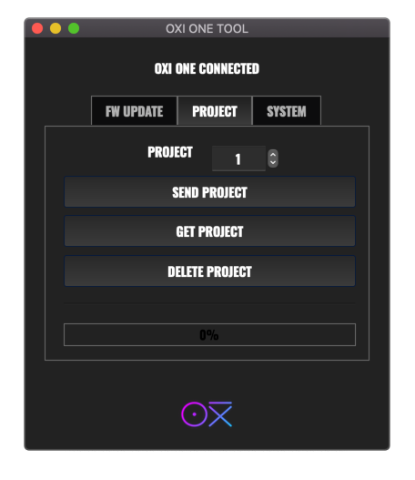

# OXI-Desktop

OXI-Desktop is a free software to update the firmware of your [OXI One](https://oxiinstruments.com/oxi-one/) and to transfer projects between the the computer and your OXI One. It runs on Mac, Windows and Linux.

The project is in very early development stage and it has limitations and known bugs.

## Usage

### FW Update
For firmware updates simply go to the FW Update tab, clic the right option and load the corresponding .syx file.
The last stable update files can be found here: [OXI One Update files](https://oxiinstruments.com/oxi-one/update) 

### Backups
You can backup your projects by selecting the project number and clicking on "GET PROJECT". The project and all its patterns will be downloaded from the OXI One into your computer. A new folder called OXI Files will be created in your desktop.
You can then send any project back to any slot of your OXI One by pressing "SEND PROJECT" and choosing the right project number. Choose the file with the .oxipro extension inside the project folder. 

## Community

For questions, suggestions and bug reports, please reach out to our community.
* https://oxiinstruments.com/forum/

## Source Code

The source code for this project is hosted on GitLab.
* https://gitlab.com/manuwind5/Oxi-Desktop-App

The _downstream_ repository on GitHub is used for publishing the builds.
* https://github.com/OXI-Instruments/OXI-Desktop/releases

## License

OXI-Desktop is published under the [GNU GPLv3](http://www.gnu.org/licenses/gpl-3.0.html) license.
